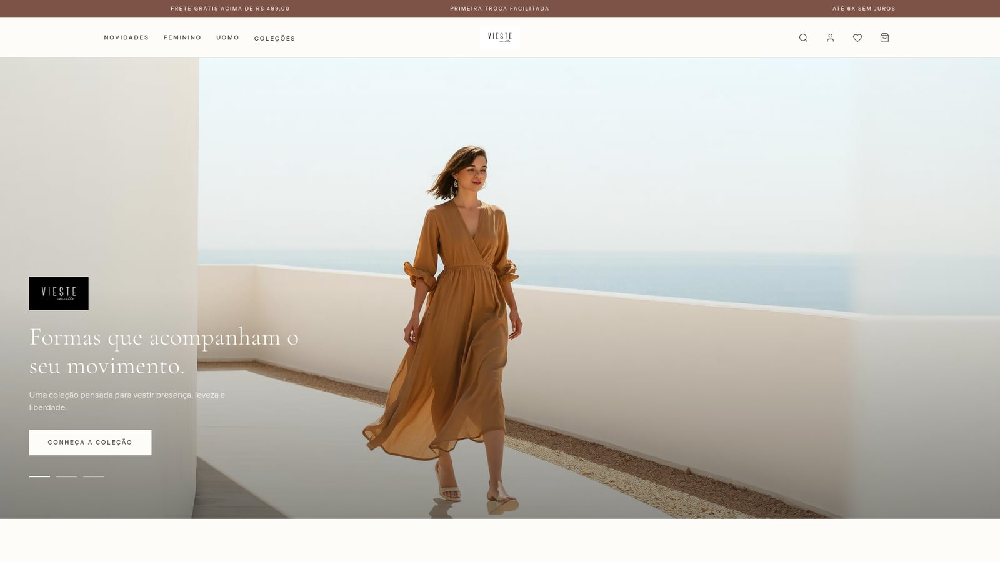
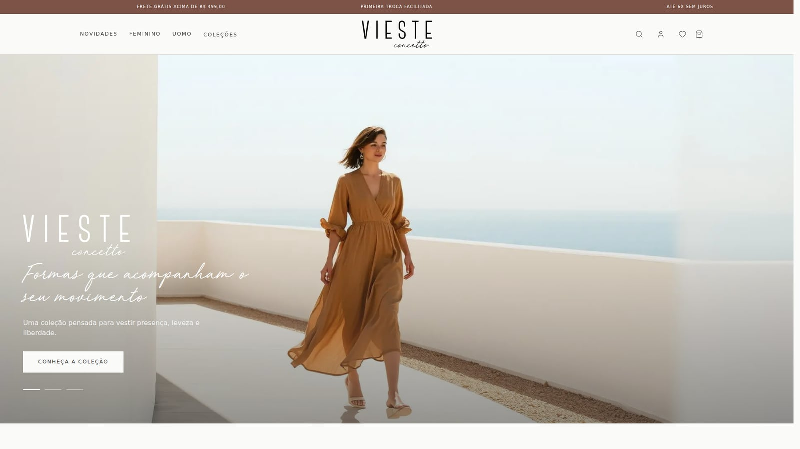

# Vieste Concetto — E-commerce

Reformulação da experiência digital e do e-commerce da **Vieste Concetto**, marca brasileira de moda contemporânea. O projeto traduz a identidade visual da marca para uma navegação editorial, responsiva e orientada à descoberta das coleções.

> Projeto real em desenvolvimento. A interface e os fluxos principais já são funcionais; integrações comerciais e operacionais ainda serão conectadas ao ambiente de produção.

## Antes e depois

<table>
  <tr>
    <th>Antes</th>
    <th>Depois</th>
  </tr>
  <tr>
    <td></td>
    <td></td>
  </tr>
</table>

A evolução visual inclui a aplicação do manual da marca, reconstrução vetorial dos logotipos, adoção da paleta oficial, incorporação da Red Velvet e uma hierarquia mais coerente entre navegação, campanha e conteúdo editorial.

## Sobre o projeto

A nova experiência foi desenhada para valorizar produto, campanha e identidade de marca sem perder a objetividade necessária a uma loja virtual. A estrutura combina uma apresentação visual ampla com acesso rápido ao catálogo, pesquisa, favoritos, conta e sacola.

Os principais objetivos da reformulação são:

- fortalecer a presença digital da Vieste;
- aproximar a experiência do site da linguagem editorial da marca;
- facilitar a descoberta das linhas Feminino e UOMO;
- oferecer uma base responsiva para a evolução do e-commerce;
- preservar desempenho, acessibilidade e nitidez dos elementos de identidade visual.

## Funcionalidades atuais

- vitrine inicial com carrossel de campanhas;
- navegação responsiva para desktop e dispositivos móveis;
- seções editoriais, coleções, lançamentos e benefícios;
- catálogo de produtos com variações visuais e informações comerciais;
- pesquisa de produtos por nome, categoria e cor;
- lista de favoritos persistida no navegador;
- sacola com inclusão, remoção, alteração de quantidade e cálculo do total;
- página dedicada de acesso e cadastro de clientes;
- painéis de favoritos e sacola;
- acesso às redes oficiais da marca no footer;
- identidade visual vetorial para manter a qualidade das marcas em qualquer tela;
- metadados para SEO, Open Graph e compartilhamento em redes sociais;
- suporte a preferências de redução de movimento.

## Tecnologias

- [Next.js 16](https://nextjs.org/) com App Router;
- [React 19](https://react.dev/);
- [TypeScript](https://www.typescriptlang.org/);
- [Tailwind CSS 4](https://tailwindcss.com/);
- otimização de imagens com `next/image`;
- fontes de marca e logotipos vetoriais servidos localmente;
- persistência local de favoritos e sacola;
- configuração adicional para execução em Cloudflare Workers com Vinext.

## Executando localmente

### Requisitos

- Node.js `22.13.0` ou superior;
- npm.

### Instalação

```bash
git clone <url-do-repositorio>
cd vieste-concetto
npm install
npm run dev
```

A aplicação estará disponível em [http://localhost:3000](http://localhost:3000).

## Comandos disponíveis

| Comando | Descrição |
| --- | --- |
| `npm run dev` | Inicia o ambiente de desenvolvimento com Next.js |
| `npm run build` | Gera e valida o build de produção |
| `npm run start` | Executa o build de produção localmente |
| `npm run lint` | Verifica a qualidade e a consistência do código |
| `npm run dev:cloudflare` | Inicia o ambiente local preparado para Cloudflare |
| `npm run build:cloudflare` | Gera o build destinado ao Cloudflare Workers |

## Estrutura principal

```text
app/                  Rotas, layout, metadados e estilos globais
components/
  account/            Acesso e cadastro da área do cliente
  layout/             Header, avisos, navegação e footer
  providers/          Estado compartilhado da experiência de compra
  sections/           Seções editoriais e comerciais da página inicial
  ui/                 Ícones e elementos reutilizáveis
data/                 Catálogo de produtos usado pela interface
public/assets/        Fotografias, marcas e recursos visuais
types/                Tipos compartilhados do domínio
```

## Estado e próximos passos

A versão atual representa a experiência de compra no front-end. Antes da publicação comercial definitiva, o projeto prevê a integração de:

- autenticação e área real do cliente;
- catálogo, estoque e preços vindos do backend;
- checkout e meios de pagamento;
- cálculo de frete e acompanhamento de pedidos;
- CMS para campanhas e conteúdo editorial;
- eventos de analytics e monitoramento de conversão.

## Direitos de uso

Este repositório contém identidade visual e materiais de um projeto comercial real. A marca **Vieste Concetto**, seus logotipos, fotografias e demais ativos visuais pertencem aos seus respectivos titulares. O conteúdo não deve ser reutilizado ou redistribuído sem autorização.
